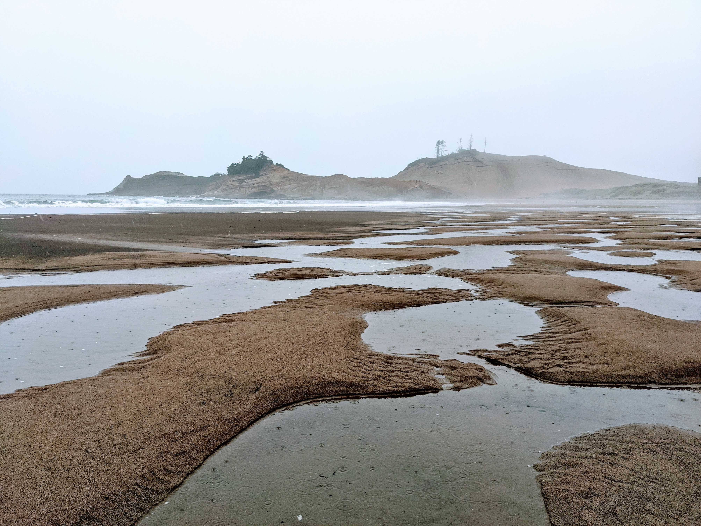

# bimap

[](https://github.com/clintval/bimap/actions/workflows/unit-tests.yml)
[](https://codecov.io/gh/clintval/bimap)
[](https://www.scala-lang.org/)

A modern bidirectional map in Scala



```scala
val map = BiMap(1 -> "1", 2 -> "2")
map.containsKey(1) shouldBe true
map.containsKey(2) shouldBe true
map.containsValue("1") shouldBe true
map.containsValue("2") shouldBe true
map should have size 2
```

#### Build with this Package using Mill

```scala
ivyDeps ++ Agg(ivy"io.cvbio::bimap::0.0.1")
```

#### Build with this Package using SBT

```scala
libraryDependencies += "io.cvbio" %% "bimap" % "0.0.1"
```
